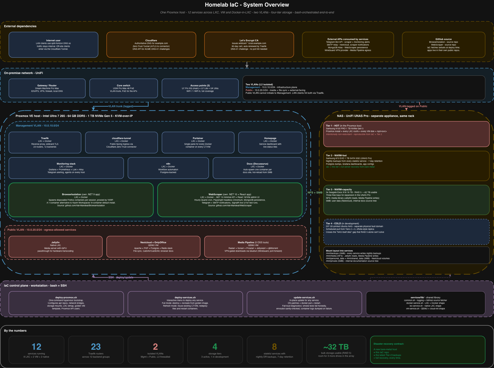

# Homelab IaC

A working single-operator homelab, built from scratch. One Proxmox hypervisor, twelve services spread across LXC containers, full VMs, and Docker-in-LXC. Two isolated VLANs. Four storage tiers. Wildcard TLS via DNS-01. End-to-end orchestration in bash, driven from a single workstation over SSH.

This repo is the **orchestration layer** - the configs, the deploy and update scripts, the disaster-recovery design - not the running infrastructure itself. The actual application code for the two custom services that grew out of the lab lives in its own public repos (linked below).

## At a glance



> Diagram source: [`public-readme/diagrams/system-overview.drawio`](public-readme/diagrams/system-overview.drawio).
> All diagrams in this repo are editable in [draw.io](https://app.diagrams.net) - the `.png` exports next to each source are regenerated on demand.

## By the numbers

- **12 services** running today - 8 in LXC, 2 in QEMU VMs, 2 native containers
- **23 Traefik routers** across 12 backend groups - HTTP routing fully declarative
- **2 isolated VLANs** - management plane and public-facing services kept on separate L2 segments
- **4 storage tiers** - hot NVMe, warm SSD for backups, warm HDDs for capacity, cold tier (in development)
- **8 stateful services** with nightly tarball backups, 7-day rolling retention
- **90-day wildcard TLS cert** auto-renewed via ACME DNS-01 - never had to touch port 80
- **1 command** rebuilds the hypervisor from a fresh Proxmox install
- **2 apps** extracted into their own public repos when they outgrew the lab

The single most load-bearing engineering decision in the whole stack: **the hot storage tier is intentionally non-redundant**, because the contract is "IaC plus the latest warm-tier tarballs is the entire disaster-recovery payload." Adding RAID on the hot path would slow it down to protect data that already has a better copy. The recovery walk-through, with concrete commands, is in [`public-readme/architecture.md`](public-readme/architecture.md).

## What's in here

```
Homelab-IaC/
├── deploy-proxmox.sh       # one-command hypervisor bootstrap (DR target)
├── deploy-services.sh      # interactive menu, full-recreate or refresh
├── update-services.sh      # in-place updates, no CT/VM destroy
├── configs/                # per-service env files + .env.example templates
│                           # (real .env files are gitignored - keep your secrets out)
├── services/
│   ├── docker/             # LXC + Docker services (one folder per service)
│   ├── lxc/                # native LXC services (Jellyfin)
│   ├── vm/                 # QEMU VM services (Nextcloud, Media Pipeline)
│   └── lib/                # shared deploy library: common, docker, lxc, vm shapes
├── proxmox-dr/             # hypervisor bootstrap - storage, network, golden image
└── public-readme/          # the architecture and engineering tour - read this for depth
    ├── architecture.md     # full system walkthrough, all 8 diagrams
    ├── engineering-highlights.md   # the stories worth talking through
    └── diagrams/           # .drawio sources for every diagram in this README + the tour
```

Each service folder under `services/` is self-contained: `deploy.sh` to create it, `update.sh` to refresh it, `docker-compose.yml` or `bootstrap.sh` for the runtime, and where applicable, `nightly-backup.sh` + `restore.sh` for the disaster-recovery side.

## Tech stack

**Hypervisor + containers:** Proxmox VE - LXC - QEMU/KVM - Docker - Docker Compose

**Networking:** UniFi (gateway, switch, APs) - Traefik v3 - Cloudflare Tunnel - Cloudflare DNS - Let's Encrypt (DNS-01 ACME challenge)

**Observability:** Grafana - Prometheus - Loki - Alloy (log shipping, metric scraping, alerting via Telegram)

**Storage:** ext4 on NVMe (hot) - SATA SSD over SMB (warm-fast) - 3-disk RAID 5 spinning rust over NFS + SMB (warm-capacity)

**Apps built on top:** .NET 9/10 (BrowserIsolation, WebScraper) - React 18 + TypeScript + Vite (WebScraper admin UI) - Playwright (scraper) - YARP (proxy) - Docker.DotNet (container management) - SignalR (live UI streaming)

## Companion repos - apps extracted from this lab

Two services started life inside this monorepo and graduated to their own public projects when they got substantial enough to justify it:

- **[BrowserIsolation](https://github.com/Vali-Mandeal/BrowserIsolation)** - a lightweight self-hosted alternative to Kasm Workspaces. One .NET service spawns disposable Firefox containers on demand and YARP-proxies sessions back to the user. Replaces eight Kasm service containers with one.
- **[WebScraper](https://github.com/Vali-Mandeal/WebScraper)** - a self-hosted classified-ads watcher. Playwright headless Chromium, Quartz cron, hourly scan against configurable sites, Telegram/SMTP notifications, React admin UI for managing jobs and watching live runs over SignalR.

Both are fetched at deploy time by this lab's IaC (`SERVICE_REPO_URL` in each service's config), so the runtime always pulls a tagged source tree rather than carrying a vendored copy.

## Documentation tour

The README hits the highlights. For depth:

- **[Architecture](public-readme/architecture.md)** - the full system tour. Hardware, VLAN design, every service with its diagram, the storage model, the recovery walk-through with concrete commands.
- **[Engineering highlights](public-readme/engineering-highlights.md)** - the decisions worth talking through in an interview. Why the hot tier has no RAID. Why no script in this repo can write `routes.yml` and `update_traefik_routes` in the same run. How the layered bash library makes adding a new service a 4-file change.

---

This is a personal homelab and a portfolio piece, not a product. No license is granted - the code is here to be read, not reused as-is.
