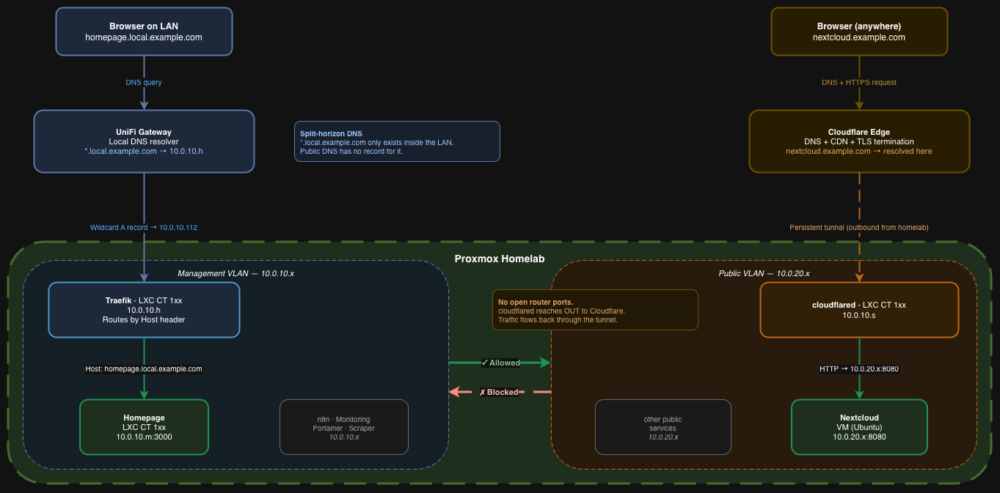
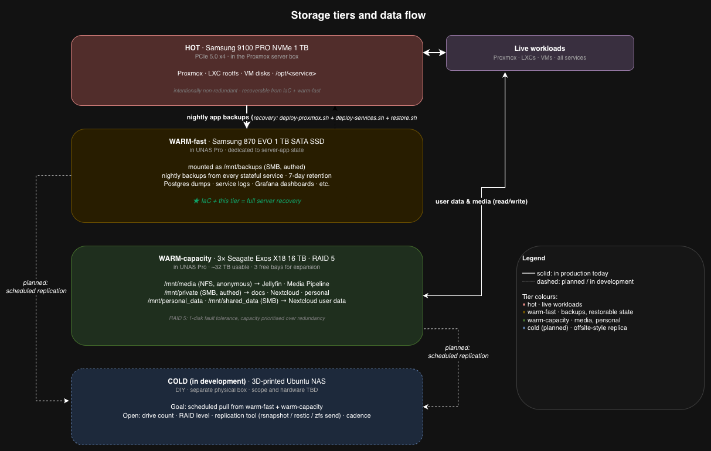
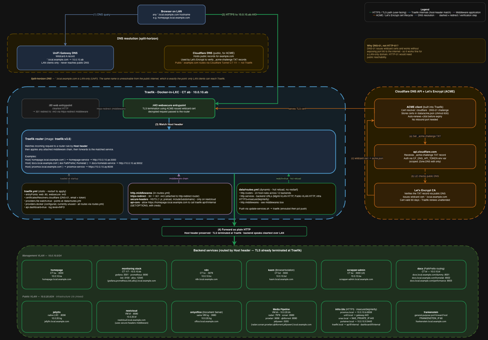
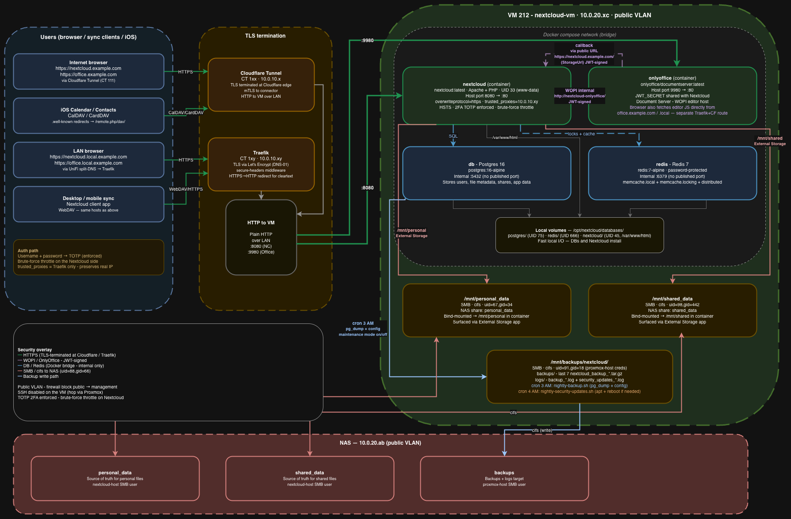
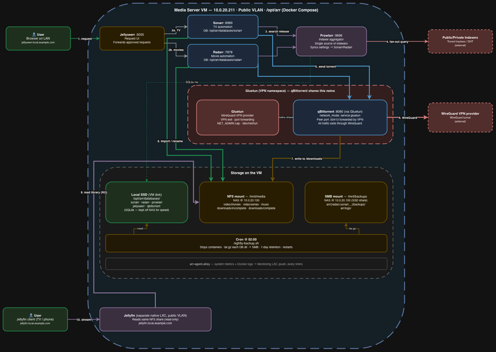
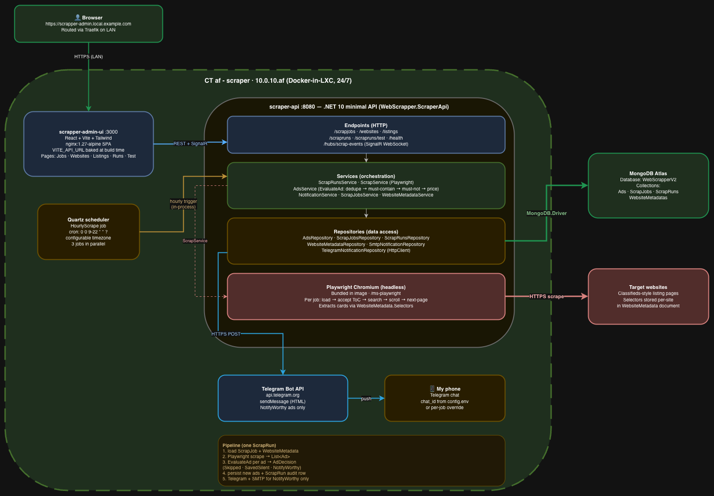
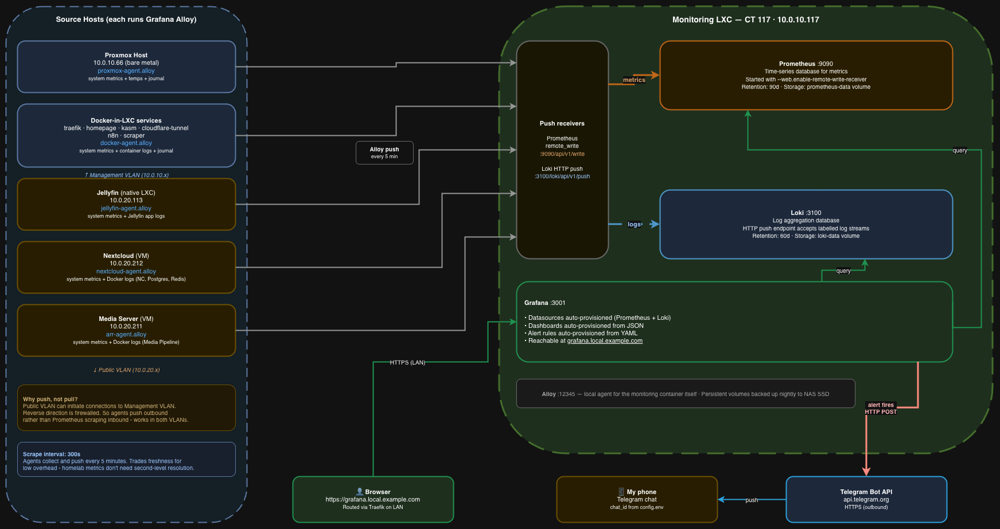
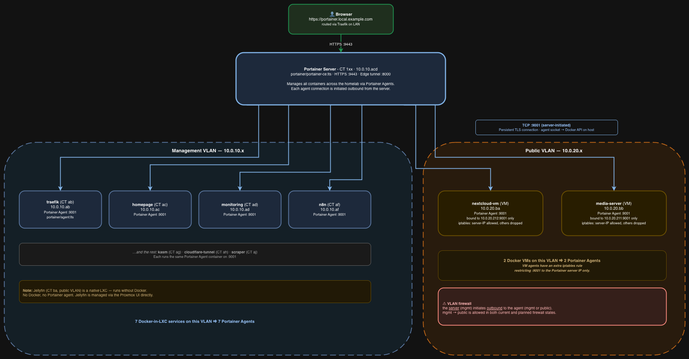

# Architecture

A guided tour of the homelab, top to bottom. Hardware first, then the network, then the hypervisor and the services that live on it, then how storage works, then how requests reach a service, then how the lab survives a disk dying.

Every diagram below has its `.drawio` source next to it in [`diagrams/`](diagrams/). The PNG files are the renders that GitHub displays; the .drawio files are the editable sources.

---

## 1. Hardware

The whole lab runs on three boxes that fit in a small rack:

**Server**
- Intel Core Ultra 7 265 (Arrow Lake), 2.4 GHz, 20 threads
- 64 GB DDR5-6000 (2x32) CL30
- 1 TB Samsung 9100 PRO NVMe (PCIe 5.0 x4) - the hot tier, holds Proxmox and every VM/CT disk
- GIGABYTE B860 motherboard, 650 W 80+ Gold PSU
- Geekworm KVM-A3 + Raspberry Pi 4 as out-of-band KVM-over-IP (so the lab is recoverable even if the network's off)

**Network (UniFi)**
- Dream Machine Pro Max as the gateway - IDS/IPS, VPN, firewall, local DNS
- USW Pro Max 48 PoE as the core switch - VLAN tagging, PoE for the APs
- Three access points covering the apartment: U7 Pro XG (main), U7 Lite (secondary), UK Ultra (third room)

**NAS**
- UniFi UNAS Pro chassis with 7 bays
- Slot 1: 1 TB Samsung 870 EVO SATA SSD - the warm-fast tier (server-app backups only)
- Slots 2-4: 3x 16 TB Seagate Exos X18 in RAID 5 - the warm-capacity tier (~32 TB usable)
- Slots 5-7: free, room for future expansion

Single-box Proxmox is a deliberate trade-off. Clustering buys live migration but doubles the hardware footprint and complicates the storage story. For a single-operator lab, "one tight box plus a real recovery story" wins over "redundant nodes with a fragile shared-storage plan."

---

## 2. Network topology

Two VLANs on the same physical fabric. Same wires, same switch, separate broadcast domains, separate firewall policy.

| VLAN | CIDR | Who lives here | Why |
|------|------|----------------|-----|
| Management | 10.0.10.0/24 | Traefik, monitoring, dashboards, automation, custom apps | Infra plane. Initiates outbound, accepts LAN traffic via Traefik. |
| Public | 10.0.20.0/24 | Jellyfin, Media Pipeline, Nextcloud, OnlyOffice | Services that talk to the internet a lot (downloads, public-facing access). Cannot initiate connections back into Management. |

The split-horizon DNS makes this clean for users: `*.local.example.com` resolves via UniFi DNS to Traefik on the management VLAN, regardless of which VLAN the actual backend lives on. The user never sees the topology.

*Where a request goes from the moment the browser types a hostname.*

---

## 3. Hypervisor and services

One Proxmox VE host. Twelve services. Three shapes:

| Shape | Used for | Examples |
|-------|----------|----------|
| LXC + Docker | Most services - lightweight, container-isolated, Docker for the runtime | Traefik, monitoring stack, n8n, BrowserIsolation, WebScraper, Homepage, Portainer, docs, cloudflare-tunnel |
| Native LXC | When the service maps cleanly to a single OS process and benefits from direct hardware access | Jellyfin (with iGPU passthrough for hardware transcoding) |
| QEMU VM | When the service is heavy enough to want its own kernel, or needs nesting (Docker-in-VM) | Nextcloud, Media Pipeline |

The choice between LXC and VM isn't religious - it follows from what the service actually needs. The shared library at [`services/lib/`](../services/lib/) has one file per shape (`docker-service.sh`, `lxc-service.sh`, `vm-service.sh`) so a new service's `deploy.sh` reads as "use this shape, here are the parameters" rather than re-implementing each provisioning flow.

### Service inventory

| Service | Shape | Purpose |
|---------|-------|---------|
| `traefik` | LXC + Docker | Reverse proxy, wildcard TLS termination, host-header routing |
| `cloudflare-tunnel` | LXC + Docker | Cloudflare Zero-Trust tunnel - the public-facing ingress |
| `portainer` | LXC + Docker | Web UI for managing every Docker container on every CT/VM |
| `homepage` | LXC + Docker | Single dashboard tile per service with live status |
| `docs` | LXC + Docker | Internal Docusaurus sites (per-team docs hot-reloaded from the SMB share) |
| `monitoring` | LXC + Docker | Grafana + Prometheus + Loki + Alloy stack with Telegram alerting |
| `n8n` | LXC + Docker | Workflow automation, Postgres-backed |
| `BrowserIsolation` (kasm) | LXC + Docker | Disposable browser sessions - my own .NET app, separate public repo |
| `WebScraper` (scraper) | LXC + Docker | Hourly classified-ads scraper - my own .NET + React app, separate public repo |
| `jellyfin` | Native LXC | Media server with iGPU passthrough for hardware transcoding |
| `Nextcloud` + `OnlyOffice` | QEMU VM | File sync, CalDAV/CardDAV, browser-edited documents |
| `Media Pipeline` | QEMU VM | Radarr + Sonarr + Prowlarr + Jellyseerr + qBittorrent (Gluetun-tunnelled) |

---

## 4. Storage

Four tiers, each with a clear job. The single most load-bearing design choice is keeping the hot tier completely non-redundant on purpose - it's reproducible from IaC plus the warm-fast tier, and adding RAID on the hot path would slow it down to protect data that already has a better copy.

*Hot to warm-fast (nightly), warm-capacity for media and personal files, cold as the planned offsite replica. The green arrow back is the recovery path.*

| Tier | Where | What's on it | Redundancy |
|------|-------|--------------|------------|
| Hot | 1 TB NVMe in the Proxmox box | Proxmox, every LXC rootfs, every VM disk, /opt/\<svc\> | None - deliberately |
| Warm-fast | 1 TB SATA SSD in UNAS Pro | Nightly tarballs from every stateful service, 7-day retention | None at the disk level - the data is the backup |
| Warm-capacity | 3x 16 TB HDDs in UNAS Pro | Media library, Nextcloud user data, internal docs source | RAID 5 (one disk fault tolerance) |
| Cold (in dev) | DIY box, planned | Replica of Warm tiers, on a different fault domain | TBD |

### Mount layout from services

| Mount | Type | Used by |
|-------|------|---------|
| `/mnt/backups` | SMB | Every stateful service writes nightly tarballs here |
| `/mnt/media` | NFS (no auth) | Jellyfin (read), Media Pipeline (read/write) |
| `/mnt/personal_data` | SMB (authed) | Nextcloud "Personal Files" external storage |
| `/mnt/shared_data` | SMB (authed) | Nextcloud "Shared Files" external storage |
| `/mnt/private` | SMB (authed) | Internal documentation source tree (Docusaurus reads here) |

### Recovery model

The whole point of the storage design is this: **a new bare-metal box, plus this IaC repo, plus the latest tarballs on `/mnt/backups`, is the complete disaster-recovery payload**. Concretely:

| Failure | Recovery path | Lost data |
|---------|---------------|-----------|
| Hot NVMe fails | New NVMe → `deploy-proxmox.sh` → `deploy-services.sh` (all) → per-service `restore.sh` from `/mnt/backups/<svc>/backups/` | Last 24 hours of incremental state, max |
| One HDD in warm-capacity fails | Pop it out, slot in a new one, let the array rebuild | Nothing |
| Two HDDs in warm-capacity fail | Cold tier is the only saviour - currently no answer until Tier 4 is built | Media and personal files |
| Warm-fast SSD fails | Replace, rebuild from running services (each service's nightly script can be invoked on demand) | The recovery point window between failure and replacement |
| Whole UNAS Pro dies | Same as the two-HDD scenario - cold tier is the only saviour | Same |

The "two-HDD or whole-NAS failure" line is the one open gap. Finishing the cold tier closes it. Every other scenario in the table has a tested path.

---

## 5. How a request reaches a service

Traefik is the front door for every LAN service. Cloudflare Tunnel is the front door for the handful of services that need to be reachable from the open internet. The two paths never overlap - LAN requests never traverse Cloudflare, internet requests never traverse Traefik.

*Browser DNS query → Traefik :443 → host-header match → backend. 23 routers, 12 backend groups, all declared in one `routes.yml`.*

A few details worth calling out:

- **Wildcard TLS via DNS-01 challenge.** Port 80 is closed on the gateway. Let's Encrypt verifies via a TXT record set on Cloudflare DNS, which means certificates work for LAN-only hostnames that public clients can't reach. The trade-off vs HTTP-01 is one Cloudflare API token instead of one open port.
- **HSTS only where it matters.** Applied to Nextcloud via the `secure-headers` middleware - the rest of the services don't need it and adding it everywhere makes local dev painful.
- **CORS to the Traefik API** comes from the Homepage dashboard so it can show "Traefik routers loaded" as a tile. Configured via the `api-cors` middleware, scoped to one origin.
- **Public hostnames (`*.example.com`)** are served by Cloudflare Tunnel CT directly to backends, bypassing Traefik. That's why the deployed `routes.yml` only contains `*.local.example.com` rules.

---

## 6. Per-service tours

For the services that have enough moving parts to deserve their own diagram:

### Nextcloud + OnlyOffice

A QEMU VM running a Docker Compose stack: Nextcloud (Apache + PHP), OnlyOffice Document Server (for browser-edited Word/Excel/PowerPoint), Postgres (database), Redis (file locking + cache). User data lives on NAS SMB shares bind-mounted into the container and exposed via Nextcloud's External Storage app - so the actual files never touch the VM's local disk, only the configs and the database do. Both Postgres and the Nextcloud install live on local NVMe for fast I/O.

### Media Pipeline

Another VM, this time running a Compose stack with Radarr, Sonarr, Prowlarr, Jellyseerr, and qBittorrent. The interesting part is the Gluetun sidecar: all torrent traffic is routed through a WireGuard tunnel with port forwarding, and qBittorrent uses Gluetun's network namespace so a VPN drop = no leak. Each service has its config on the warm-fast SSD share, with nightly tarball backups before any change.

### WebScraper

A .NET 10 service hosted in an LXC + Docker stack, with a React 18 + Vite admin UI as a sibling container. Quartz fires hourly, the orchestrator pulls active scrape jobs, Playwright headless Chromium walks each target site, an evaluator filters by keyword + price, dedupes by URL-derived ID, persists new ads, and fan-outs notifications to Telegram + SMTP. SignalR streams per-ad decisions to the admin UI when a job is run in test mode. Full source at [github.com/Vali-Mandeal/WebScraper](https://github.com/Vali-Mandeal/WebScraper).

### Monitoring stack

Grafana + Prometheus + Loki + Alloy, all in one LXC. Alloy is the unified collector - runs on every CT/VM as an agent and ships metrics to Prometheus and logs to Loki. Grafana fronts both. A handful of dashboards plus a Telegram contact point on the alerting side. The whole stack writes its state to local disk and tars itself to the warm-fast share at 02:00 nightly.

### Portainer

Centralised view of every Docker container running across every LXC/VM. The agent runs as a small container on each host; the Portainer server itself runs in its own LXC and is reachable via Traefik. Used for `docker exec` and live log tailing when something needs eyeballs on it.

---

## 7. The IaC layer

Three top-level scripts driven from a workstation over SSH:

- [`deploy-proxmox.sh`](../deploy-proxmox.sh) - bootstrap the hypervisor itself. Configures Proxmox's apt repos, network bridges, storage mounts, LXC ID mapping, a golden Ubuntu cloud-init VM template, and the API users.
- [`deploy-services.sh`](../deploy-services.sh) - interactive menu to deploy any of the 12 services. Two modes: `full` (destroy and recreate the CT/VM, used after a disk failure or when starting from scratch) and `refresh` (keep the CT/VM, redeploy files and restart containers, used for everything else).
- [`update-services.sh`](../update-services.sh) - in-place updates. Pulls new Docker images, redeploys `docker-compose.yml`/configs, restarts the stack. No CT/VM destruction.

Underneath, the [`services/lib/`](../services/lib/) directory has the shared shape libraries: `docker-service.sh` for LXC + Docker services, `lxc-service.sh` for native LXC, `vm-service.sh` for QEMU VMs. Each service's `deploy.sh` is mostly orchestration of library functions plus the service's specific bits (compose file, bootstrap script, restore script). Adding a new service is a four-file change: a `configs/<name>.env` (gitignored, real values), a `configs/<name>.env.example` (template), a `services/<shape>/<name>/deploy.sh`, and the service-specific runtime files (compose, bootstrap, etc.).

The deeper lessons - why no script writes another script's config file, why every wait-loop has to fail loudly instead of silently passing, how the two extracted apps came out of this lab - are in [`engineering-highlights.md`](engineering-highlights.md).
